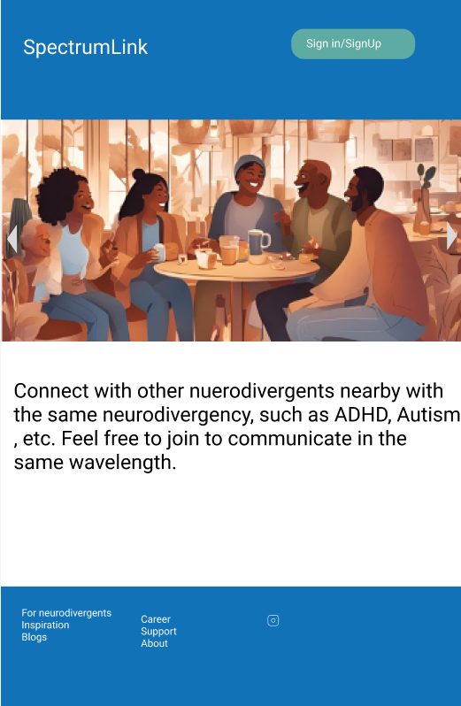
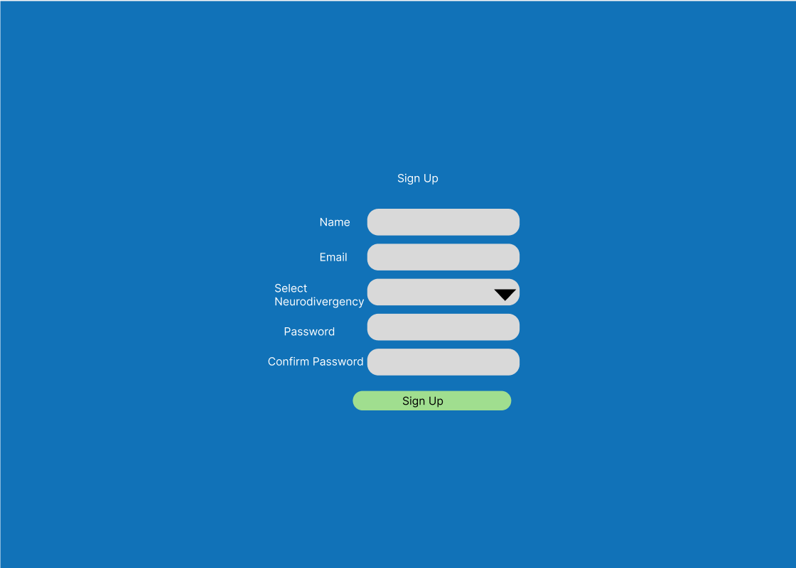
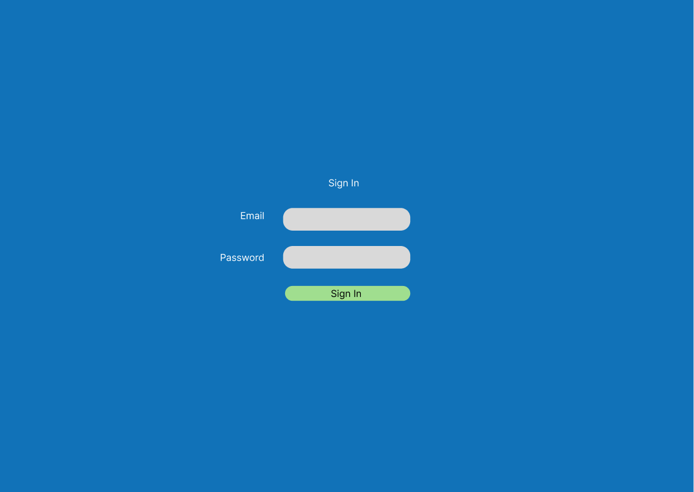
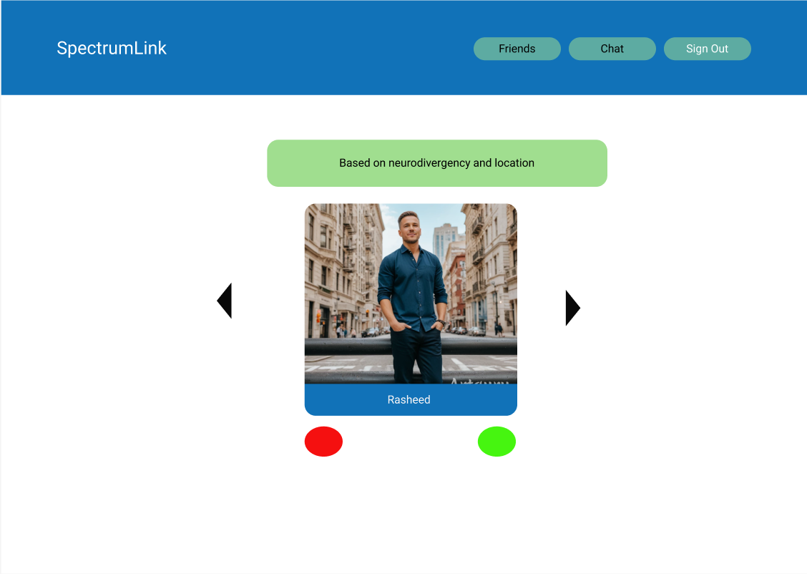
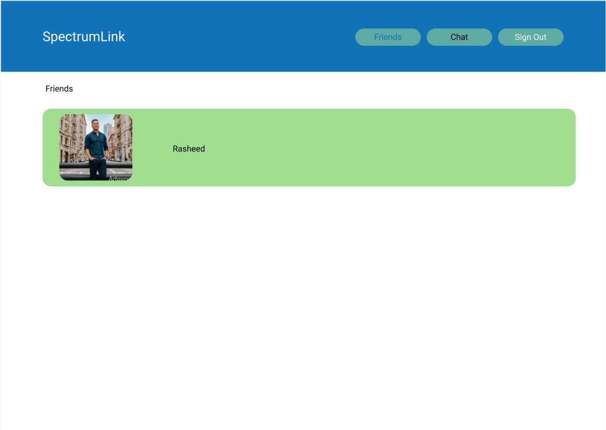
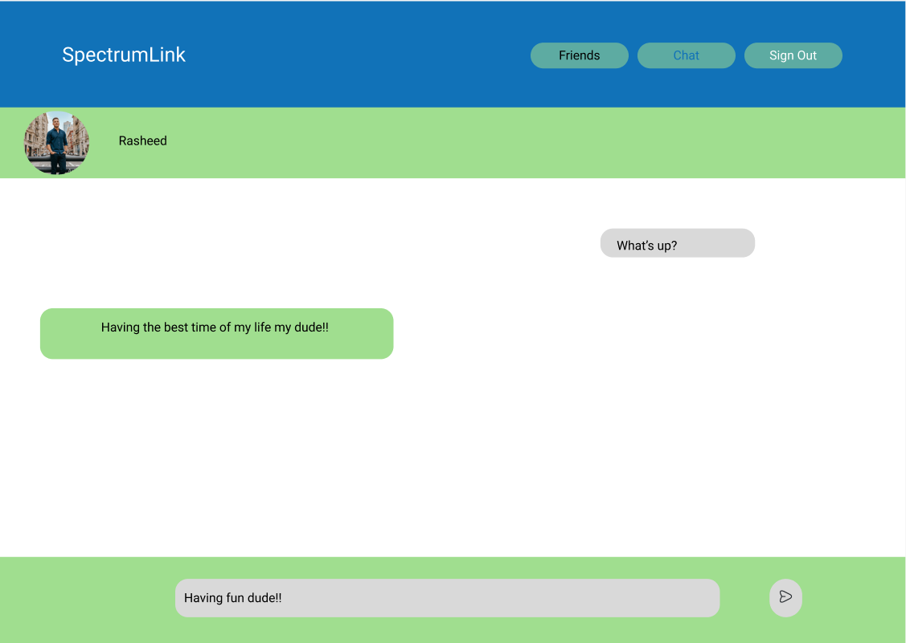
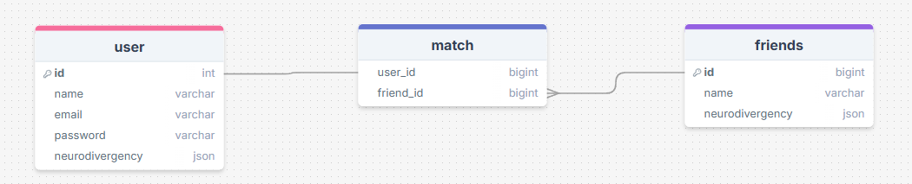

# Project Title
SpectrumLink

## Overview
SpectrumLink is a platform that connects neurodivergent based on their neurodivergence and location. It is adjacent to Tinder, except it is for neurodivergent and not
anyone looking for romance.

### Problem
As a neurodivergent, there was a struggle with making friends and becoming part of the community with people who are also on the spectrum. Neurodivergents typically use 
platforms such as Reddit and Facebook. However, these apps don't match any neurodivergents based on their neurodivergency. So, what needs to be added is an app for neurodivergents that connects better with an easy-to-use app.


### User profile

- Neurodivergents:
    - looking to make friends nearby
    - looking to make friends at a given location 
    - have the ability to chat with friends within the same wavelength

### Features 

- As a logged in user, I want to be able to find friends nearby
- As a logged in user, I want to match with get suggestions based on our neurodivergency being matched
- As a logged in user, I want to have the option to be friends with the suggested person or not
- As a logged in user with friends, I want to message these friends one on one
- As a logged in user with friends, I want to manage my friends list

- As a user, I want to create my own account for registration
- As a user, I want to fill in my neurodivergency while registering
- As a user, I want to have the option to sign in and sign out

## Implementation

### Tech Stack

- React
- TypeScript
- PostgresSQL
- Express
- Client-libraries
   - react
   - react-router-dom
   - axios
   - sass
- Server-libraries
   - knex
   - express
   - cors
   - sockets.io for chat messaging
   - bcrypt for password hasing


### APIs

- One third-party API will be used for user location, which is MapBox
- For user matching, an internal API will be created

### Sitemap

- Home page
- Sign-In Page
- Registration Page
- Dashboard for logged in user
- Friends list page
- Chat page based on the friends selected

### Mockups

### HomePage 


### Register 


### Log-In 


### Dashboard 


### Friend-List Page


### Chat Page 


### Data 



### Endpoints 

**GET /**

- Get suggested friends of the logged in user

Parameters:
- longitude: User's location as anumber
- latitude: User's location as a number
- token: JWT of the logged in user

Response:
```
[
    {
        "id": 1,
        "name" : "Rasheed"
    }
]
```

**GET /friend**

- Get friends of the logged in user

Parameters:
- token: JWT of the logged in user

Response:
```
[
    {
        "id": 1,
        "name" : "Rasheed"
    }
]
```

**GET /friend/id**

- Get friend of the logged in user based om the id

Parameters:
- id: id of the friend
- token: JWT of the logged in user

Response:
```
[
    {
        "id": 1,
        "name" : "Rasheed"
    }
]
```

**POST /users/register**

- New user to register for the account within the platform

Parameters:
- email: user's email
- password: user's password 

Response:
```
[
    {
        "token" : "ghuvasyuhbfdeuihbfriujewubferuhewfurio3894357854389789wequbiweqd"
    }
]
```

**POST /users/login**

- User to sign in to the platform

Parameters:
- email: user's email
- password: user's password

```
[
    {
        "token" : "ghuvasyuhbfdeuihbfriujewubferuhewfurio3894357854389789wequbiweqd"
    }
]
```

### Auth 
- JWT Auth will be used for this project
- The fake users will be utilized fot testing the API endpoints before JWT Auth is implemented
- JWT will be in localStorage when the user is logged in
- It will be deleted after the user logs out

### Roadmap

- Create the client using react project with routes and the boilerplate

- Create the server API using node and express

- Create the migration

- Make 10 fake accounts with geolocation data

- Create seeds with the fake users

- Bug fixes

- Demo day

### Nice-to-have features after this sprint
- Have groups based on certain interest
- User have the ability to join or create these groups
- Have a chatroom within these groups
- Have the option for dark mode
- Have avatars for users 
- Make it cross-platform for mobile 

